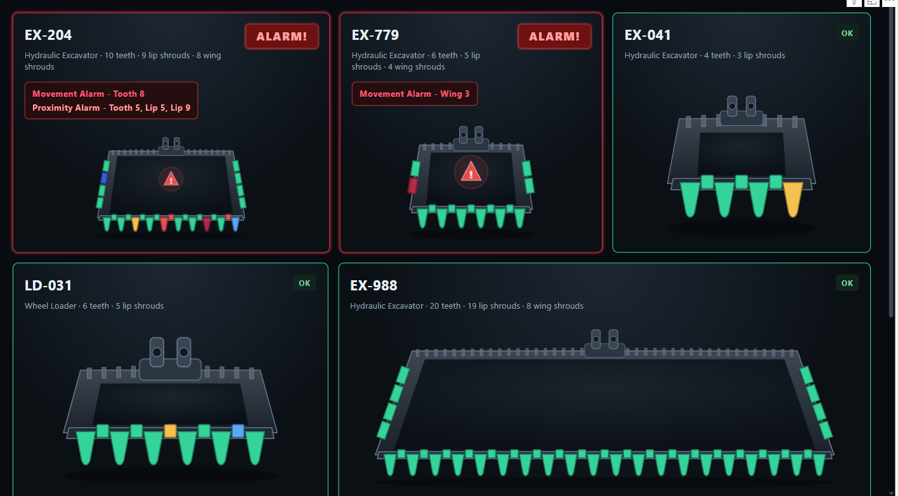
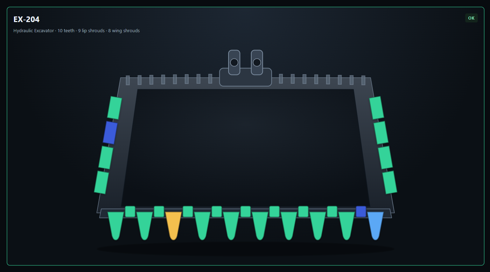
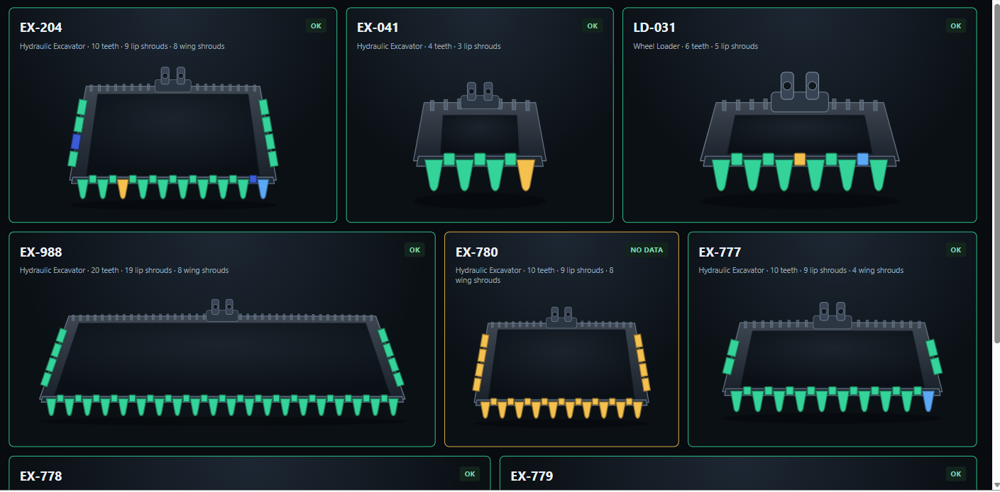
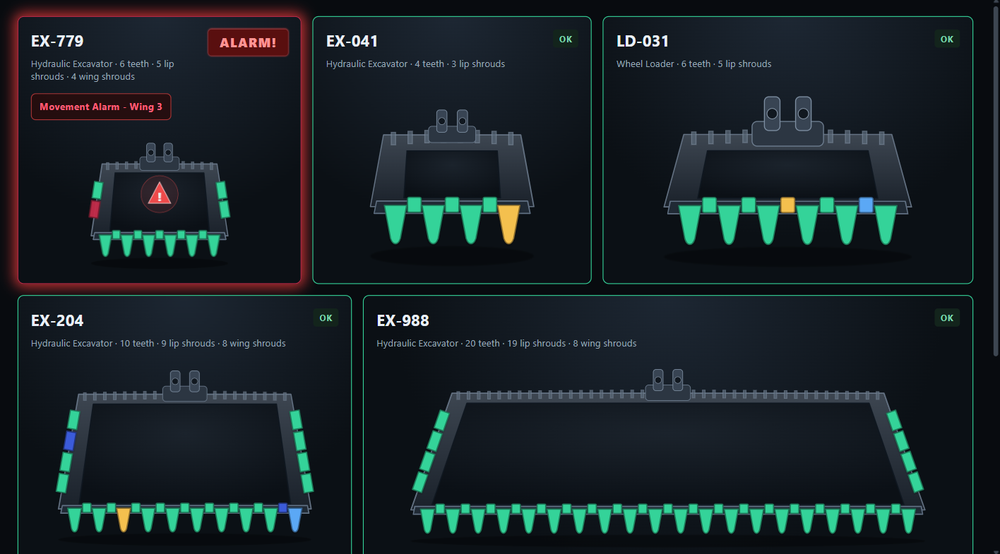
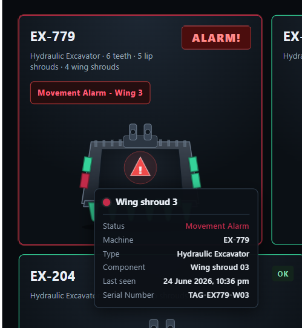
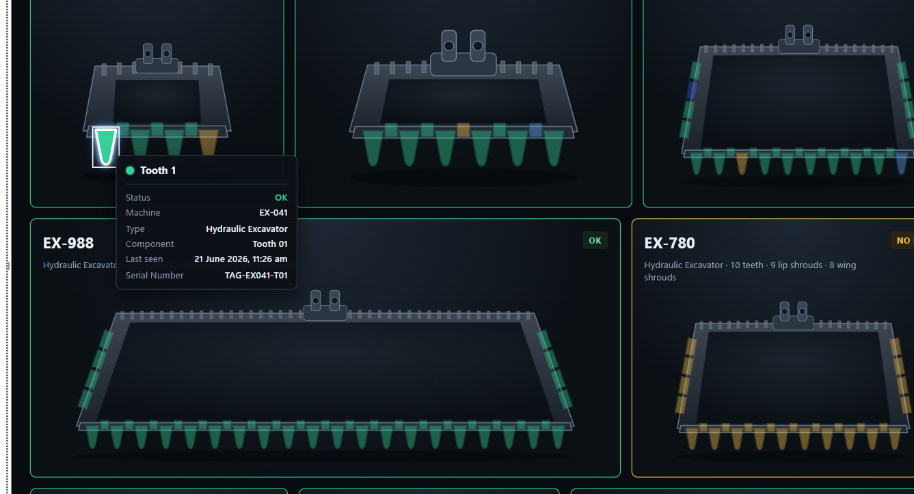
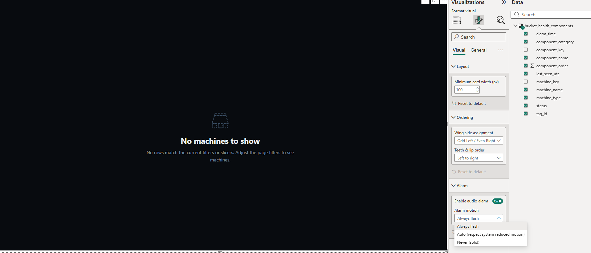

# Bucket Health for Power BI

A Power BI custom visual for real-time monitoring of mining excavator bucket GET (Ground Engaging Tools) component health. Each machine is rendered as a responsive schematic bucket with live status colours, alarm prioritisation, audio alerts, and rich tooltips.



---

## Features

- **Adaptive bucket geometry** — teeth, lip shrouds, and wing shrouds rendered from your actual component counts (4–20 teeth, 0–4 wings per side)
- **Status colour coding** — six component health states, each with a distinct colour and alarm/no-alarm behaviour (table under [Data schema](#data-schema))
- **Fleet grid** — up to 20 machines in a responsive flex grid; alarm machines sort to the front with a pulsing red border
- **Audio alert** — opt-in two-tone beep triggered on fresh alarm transitions, with auto-stop at 60 s. **Requires DirectQuery or Live Connection** — Import mode data is a static snapshot and does not push updates to the visual automatically, so audio alarms will not fire until a manual refresh.
- **Rich tooltips** — component name, status, machine, last-seen time, and any extra tooltip columns from your data
- **Cross-filter & selection** — click a component to cross-filter other visuals on the report page
- **Context menu** — right-click a component for Power BI's standard drill/filter context menu
- **Keyboard navigation** — Arrow keys move focus between components; Enter/Space selects
- **High-contrast mode** — automatically adapts fills, strokes, and outlines when Power BI's high-contrast theme is active
- **Accessible alarm motion** — choose *Always flash* / *Auto* (respects OS reduced-motion) / *Never* (solid) in the Formatting pane

---

## Screenshots

| Single machine (OK) | Fleet — no alarm | Fleet — alarm active |
|---|---|---|
|  |  |  |

| Component tooltip | Cross-filter selection | Edge state + formatting setup |
|---|---|---|
|  |  |  |

---

## Quick start

1. Download the latest `.pbiviz` from the [Releases](https://github.com/Umut-Demirhan-MBusAn/power_bi_bucket_health/releases) page (or from AppSource once published).
2. In Power BI Desktop: **Insert → More visuals → Import a visual from a file** → select the `.pbiviz`.
3. Add the visual to your report page and bind the required fields (see below).

A sample `.pbix` demo report is included at [`example_bucket_health_dashboard.pbix`](example_bucket_health_dashboard.pbix).

> **Import mode and audio alarms:** The example dashboard uses Import mode, which loads a static snapshot of the data. Audio alarms fire when the visual receives a live data update — this happens automatically with **DirectQuery** or **Live Connection** but only on manual refresh with Import mode. For real-time alarm monitoring in production, connect your report with DirectQuery or a live/streaming dataset.

---

## Data schema

Each row must represent **one component on one machine**. Bind these roles in the Fields pane:

| Role | Required | Description | Example values |
|---|---|---|---|
| **Machine** | ✓ | The machine's name and its unique identifier. Every row must belong to a machine. Each unique value becomes one card in the fleet view and is shown as the card header. | `EX-204`, `CAT-01` |
| Machine Type | — | Human-readable label for the machine class or model. Shown in the card header below the machine name. If omitted, only the machine name is shown. | `Hydraulic Excavator` |
| **Component** | ✓ | The component's name, unique within its machine. Identifies a single tooth, lip shroud, or wing shroud on that machine. Used for rendering, tooltips, selection, and alarm detection. | `T1`, `L3`, `W2R` |
| **Category** | ✓ | The component type. Determines where on the bucket schematic the component is drawn. Must be one of three exact values. | `tooth`, `lipShroud`, `wingShroud` |
| **Order** | ✓ | Integer position of the component within its category (1 = leftmost for teeth and lip shrouds). For wing shrouds, left/right side is inferred from this value by the **Wing side assignment** Formatting pane setting — there is no left/right column in the data. | `1`, `2`, `3`, … |
| **Component Status** | ✓ | The current health status of this component. Matched case-insensitively against the accepted status strings (see table below). Non-alarm statuses leave the Alarm Time cell blank. | `OK`, `No Data`, `Lockout`, `Lockout + No Data`, `Proximity Alarm`, `Movement Alarm` |
| Comp. Alarm Time | Recommended | Timestamp when this component entered its current alarm state. The visual builds an alarm identity from machine + component + alarm time; audio fires exactly once per unique identity. **If left unbound the visual still renders, but a component that clears and then re-alarms in the same session won't beep the second time** (see [Alarm audio logic](docs/DATA_SCHEMA.md#alarm-audio-logic)). Leave the cell blank (null) for non-alarm rows. | `2026-06-22T08:14:00Z` |
| Last Seen | — | Timestamp of the last data receipt for this component. Shown in the component tooltip. | `2026-06-22T08:14:00Z` |
| Tooltip Fields | — | Any additional columns to include in the component tooltip. You can bind multiple columns here. They appear after the standard fields. | Tag IDs, sensor readings, … |

### Status values

Accepted status strings (case-insensitive; alternate spellings such as `prox` or `No data (1h)` also work):

| Status | Colour | Alarm audio |
|---|---|---|
| `OK` | Green | No |
| `No Data` | Amber | No |
| `Lockout` | Blue | No |
| `Lockout + No Data` | Dark blue | No |
| `Proximity Alarm` | Flashing red | Yes — on transition |
| `Movement Alarm` | Flashing dark red | Yes — on transition |

### Component counts & layout

Each machine's bucket geometry adapts to the rows you supply: **4–20 teeth**, **lip shrouds = teeth − 1**, and **0–8 wing shrouds** (up to 4 per side). Wing shrouds have no left/right column — the side is derived from **Order** via the **Wing side assignment** setting.

See **[`docs/DATA_SCHEMA.md`](docs/DATA_SCHEMA.md)** for the full schema: exact count rules, all four wing-assignment modes, accepted status spellings, and the alarm-audio logic.

---

## Formatting pane

| Card | Setting | Description |
|---|---|---|
| Layout | Minimum card width (px) | Cards never shrink below this width; scrollbars appear instead. Default 220 px. |
| Ordering | Wing side assignment | How wing shroud order values map to left/right sides. Four modes covering odd/even and first/second-half splits. |
| Ordering | Teeth & lip order | Render teeth and lip shrouds left-to-right (default) or right-to-left. |
| Alarm | Enable audio alarm | Toggle the two-tone beep triggered on alarm transitions. |
| Alarm | Alarm motion | *Always flash* (default) · *Auto* (respects OS reduced-motion) · *Never* (solid). |

---

## Support & links

- **Bugs / feature requests:** [GitHub Issues](https://github.com/Umut-Demirhan-MBusAn/power_bi_bucket_health/issues)
- **Support page:** [https://umut-demirhan-mbusan.github.io/power_bi_bucket_health/support.html](https://umut-demirhan-mbusan.github.io/power_bi_bucket_health/support.html)
- **Privacy policy:** [https://umut-demirhan-mbusan.github.io/power_bi_bucket_health/privacy-policy.html](https://umut-demirhan-mbusan.github.io/power_bi_bucket_health/privacy-policy.html)

---

## Development

```bash
# Install dependencies
npm install

# Start local developer visual (Power BI Developer Visual)
npm run start        # or: pbiviz start

# Run unit tests
npm test

# Lint
npm run eslint

# Package for distribution
npm run package      # produces dist/*.pbiviz
```

### Repository structure

```
src/           TypeScript source
  audio/       AlarmAudio + AlarmController
  data/        DataView parser + type definitions
  domain/      Status model, colour mapping, wing-side assignment
  geometry/    Parametric bucket SVG geometry engine
  rendering/   Fleet, card, bucket SVG, and edge-state renderers
  settings.ts  Formatting pane model
  visual.ts    IVisual host contract entry point
style/         LESS stylesheet
test/unit/     Node.js unit tests (built-in runner; jsdom for rendering tests)
docs/          Spec, architecture, visual contract, certification guide
assets/        icon.png
```

### Certification

This visual targets [Microsoft AppSource certification](https://learn.microsoft.com/en-us/power-bi/developer/visuals/power-bi-custom-visuals-certified). See [`docs/CERTIFICATION.md`](docs/CERTIFICATION.md) for the full submission checklist and status.
